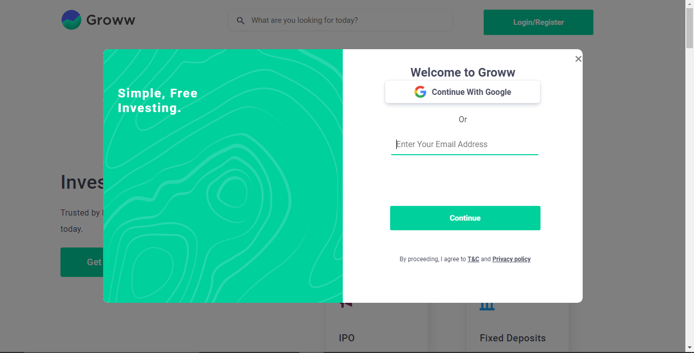
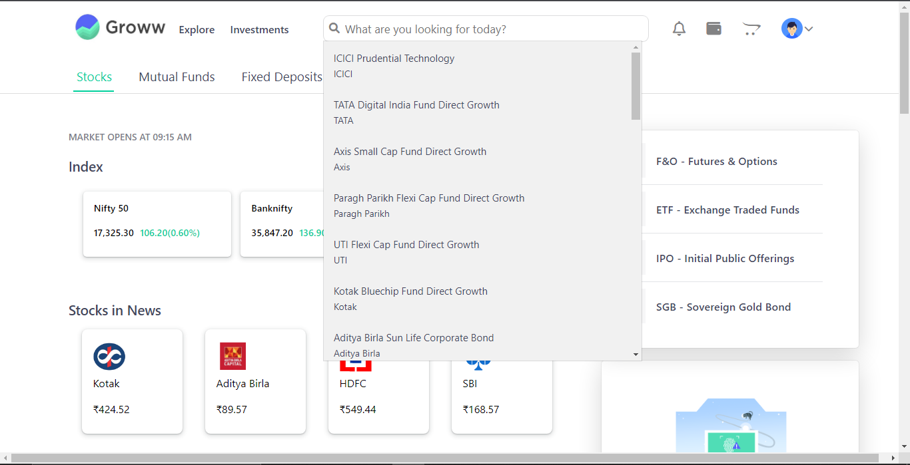
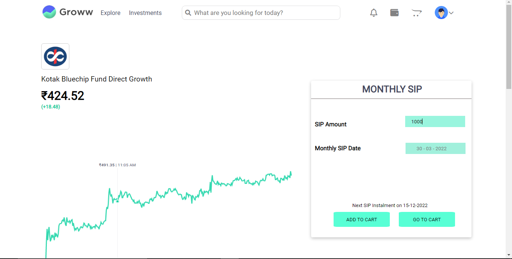
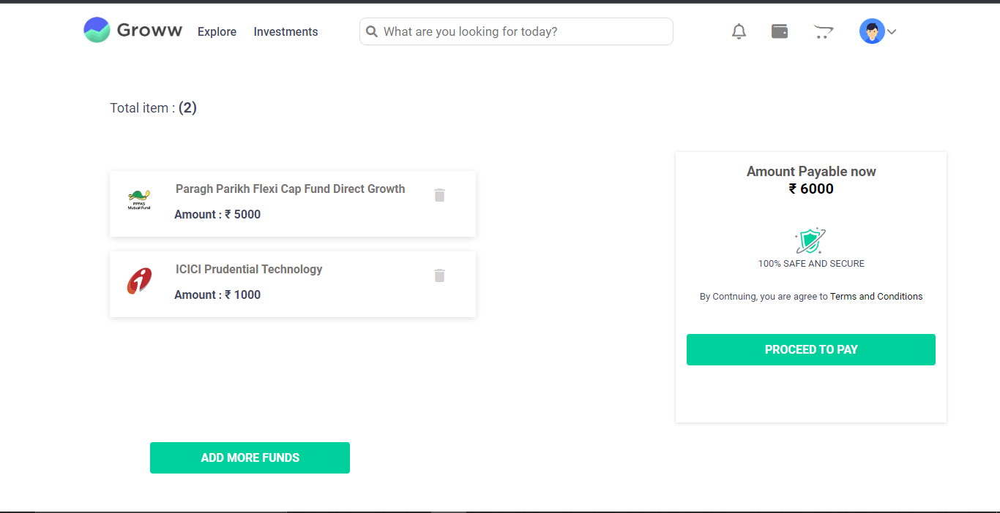
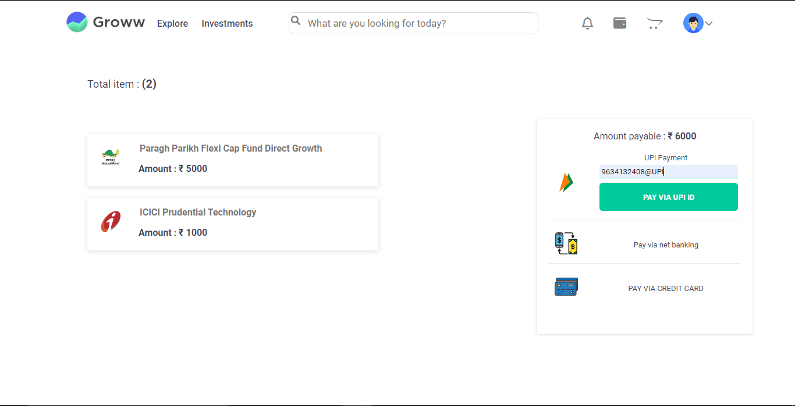

# GROWW
 Investment application
 In 2016, four Flipkart employees – Lalit Keshre, Harsh Jain, Ishan Bansal and Neeraj Singh, quit their jobs to start a venture that could make investing easy. They called this venture Groww and started operations In 2017. Here is all you need to know about the founders, the history of Groww and investors backing its vision. Apart from investing you can also avail of, eBooks educational content and blogs for stock market learning. It is due to its safe, easy use and user-interactive investing platform that as of November 2020 it had a user base of more than 90 lakh.

<h1>Groww Clone</h1>
 <h2>Landing Page</h2>
    
  <h2>Login Page</h2>
    
       <h2>Dashboard</h2>
    
        <h2>Products-Page</h2>
    
      <h2>Products-Description page</h2>
    
       <h2>Cart-Page</h2>
    
        <h2>Payment-Page</h2>
    
    <h1>[Getting Started]</h1>
    <h3>Execution</h3>
    
If you want to run our project in your local machine

    
Follow the given steps:

    <ul>
        <li>Clone our respository <a href="https://github.com/Parth-Bisht/Team-GROWW.git">https://github.com/Parth-Bisht/Team-GROWW.git</a></li>
        <li>Open our code in VS code</li>
        <li>Open 'index.html' with Live server</li>
        <li>Initialize the server by writing 'npm run start' on Terminal</li>
        <li>Than you can navigate to other pages like 'mutualfunds.html' etc</li>
    </ul>
        <h1>Built with</h1>
    <ul>
        <li>HTML</li>
        <li>CSS</li>
        <li>Javascript (ES6)</li>
        <li>DOM</li>
        <li>node js</li>
    </ul>
        <h1>Creators</h1>
    <ul>
   <li><a href="https://github.com/iamdebobrota">@Debobrota Haldar</a></li>
        <li><a href="https://github.com/Parth-Bisht">@Parth Bisht</a></li>
        <li> <a href="https://github.com/Ahmad-ft-215">@Ahmad Noor</a> </li>
      
        <li><a href="https://github.com/nitinkadam70">@Nitin Kadam</a></li>
        <li><a href="https://github.com/naushadcom">@Md Naushad Ahamed</a></li>
        <li><a href="https://github.com/Jaya8277">@Jaya Vishwakarma</a></li>
    </ul>  
